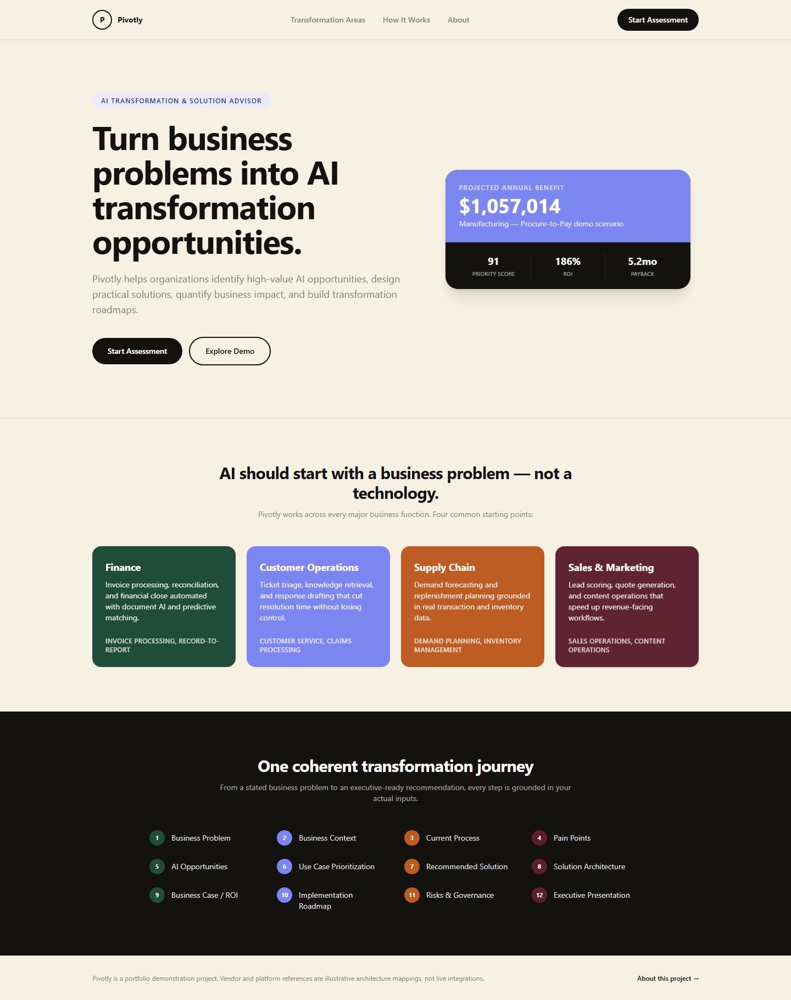
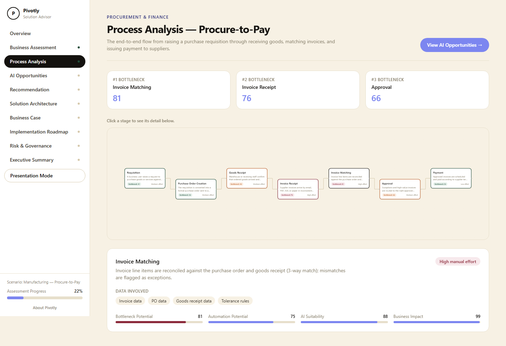
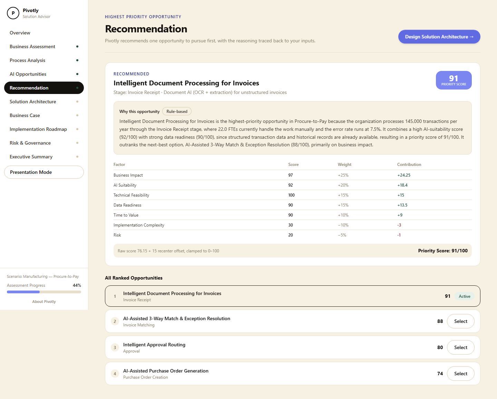
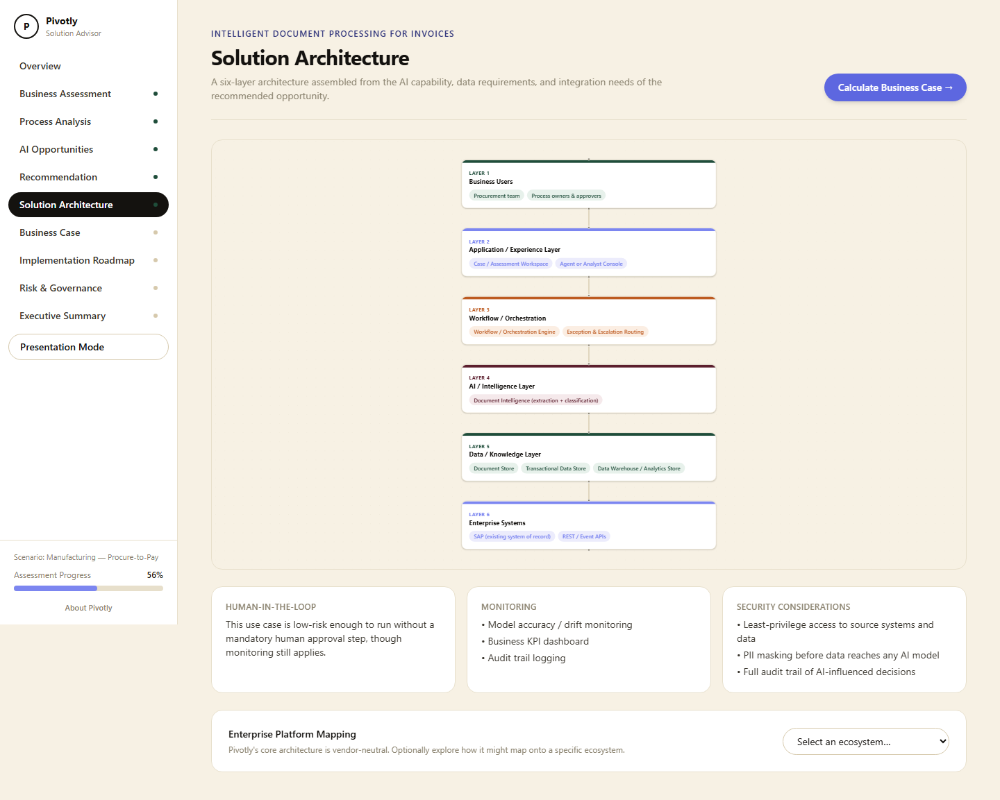
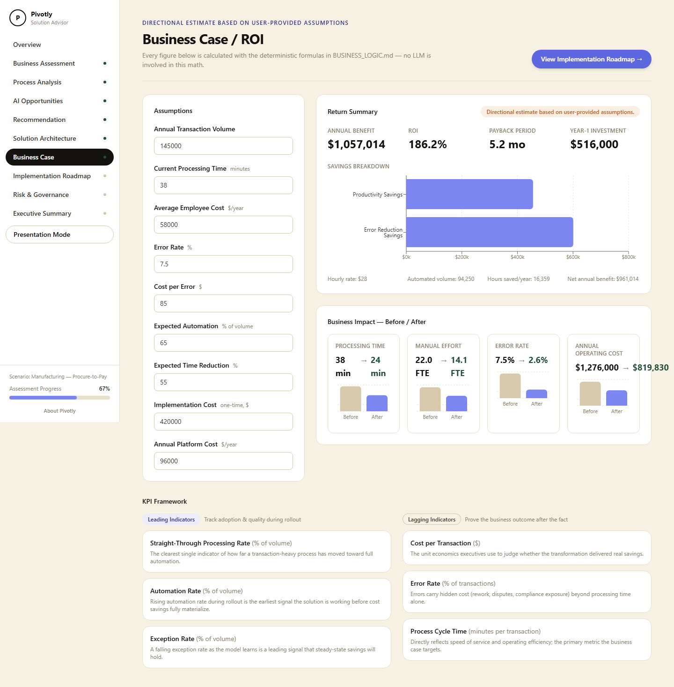
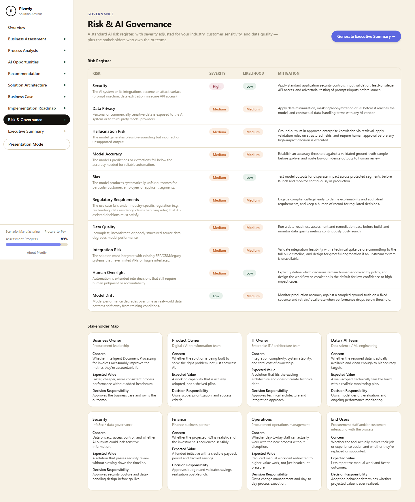
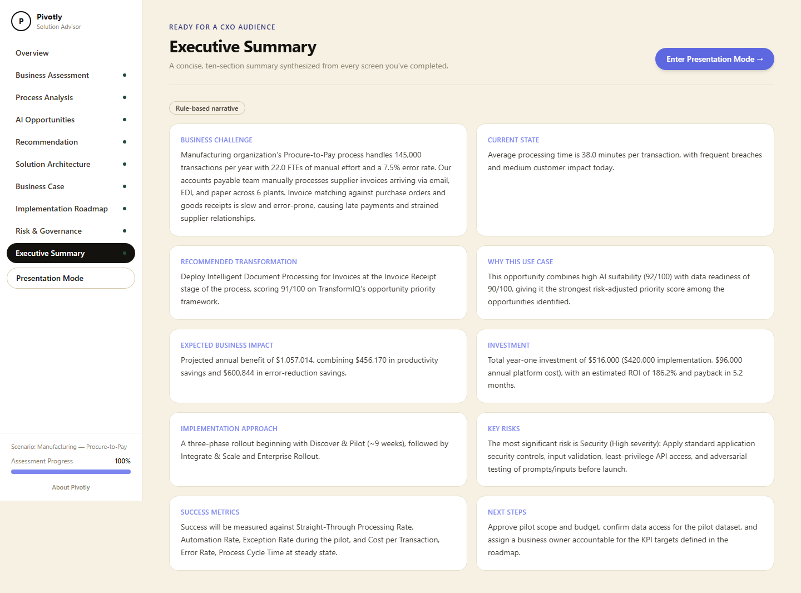

# Pivotly — AI Transformation & Solution Advisor

**🔗 Live demo: [pivotly-psi.vercel.app](https://pivotly-psi.vercel.app)**
*(Backend runs on Render's free tier — the first request after idle time can take ~30-50s to wake up.)*

Pivotly takes a real-world business problem and turns it into a scored,
architected, and financially quantified AI transformation recommendation —
the kind of workflow an AI solution advisor, presales engineer, or
transformation consultant runs for a client, built as software.

It is **not** a chatbot, a RAG demo, or an "ask AI anything" interface. The
product is the end-to-end business transformation workflow. An LLM is used
in exactly three places for narrative reasoning; every score, dollar
figure, and ranking is computed by deterministic business logic and is
fully reproducible without any AI at all.

## Why this exists

Most AI portfolio projects demonstrate an API call. This one demonstrates
the harder, more valuable skill: taking an ambiguous business problem,
grounding it in a real process, identifying where AI genuinely creates
value (and where it doesn't), building a solution architecture, quantifying
the business case, and communicating all of it to an executive audience.
See [PRODUCT.md](PRODUCT.md) for the full product thinking behind it.

## The journey

```
Business Problem → Business Context → Current Process → Pain Points →
AI Opportunities → Use Case Prioritization → Recommended Solution →
Solution Architecture → Business Case / ROI → Implementation Roadmap →
Risks & Governance → Executive Presentation
```

## Screenshots

| | |
|---|---|
|  |  |
|  |  |
|  |  |
|  | |

## Architecture

```
Frontend (React + TS + Tailwind)
        │  fetch/JSON
        ▼
FastAPI (routers)
        │
        ├── Business Logic (app/engines) ── pure functions, no I/O
        │     scoring · ROI · process analysis · opportunity detection
        │     architecture generation · roadmap · risk register · stakeholders
        │
        ├── AI Reasoning (app/ai) ── the ONLY place an LLM is called
        │     recommendation rationale · executive summary · NL problem parsing
        │     falls back to deterministic, KB-grounded templates with no API key
        │
        ├── Knowledge Base (app/knowledge_base) ── grounding layer
        │     13 business processes · AI opportunity templates · KPI catalog
        │     risk catalog · vendor-neutral platform mapping · 6 demo scenarios
        │
        └── SQLite ── saved assessments only; nothing computational depends on it
```

See [ARCHITECTURE.md](ARCHITECTURE.md) for the full breakdown and
[BUSINESS_LOGIC.md](BUSINESS_LOGIC.md) for every formula.

## Tech stack

- **Frontend**: React, TypeScript, Tailwind CSS, React Router, React Flow (process/architecture diagrams), Recharts (charts)
- **Backend**: Python, FastAPI, SQLAlchemy, SQLite
- **AI**: Anthropic Claude via structured tool-call output, with a fully functional mock mode when no API key is set

## Setup

### Backend

```bash
cd backend
python -m venv .venv
.venv/Scripts/activate        # Windows; use `source .venv/bin/activate` on macOS/Linux
pip install -r requirements.txt
cp .env.example .env          # optional — see Environment Variables below
uvicorn app.main:app --reload --port 8000
```

The API is now at `http://localhost:8000` (interactive docs at `/docs`).

### Frontend

```bash
cd frontend
npm install
npm run dev
```

The app is now at `http://localhost:5173`.

## Environment variables

Set these in `backend/.env` (copy from `.env.example`):

| Variable | Required | Purpose |
|---|---|---|
| `ANTHROPIC_API_KEY` | No | If unset, the app runs fully in **mock mode** — every screen works, using deterministic, knowledge-base-grounded text instead of live LLM calls. |
| `ANTHROPIC_MODEL` | No | Defaults to `claude-sonnet-4-5`. Only used for the three narrative-reasoning calls; never for scoring or ROI math. |
| `DATABASE_URL` | No | Defaults to a local SQLite file. |
| `CORS_ORIGINS` | No | Defaults to `http://localhost:5173`. |

No API key is required to fully evaluate the product.

## Running the tests

```bash
cd backend
pytest -q
```

33 tests cover the scoring formula, the ROI formulas, process analysis,
opportunity grounding, and a full API walkthrough of the demo flow.

## Demo scenarios

Six realistic scenarios are built in (`GET /api/scenarios`), each a
complete, internally consistent assessment: Manufacturing (Procure-to-Pay),
Retail (Customer Service), Telecommunications (Service Operations), Banking
(Loan Operations), Energy (Asset Maintenance), and Media (Content
Operations). Click **Load Demo** on the Overview screen to drop straight
into the full journey.

## Example workflow

1. Open the app and click **Load Demo** on the Manufacturing — Procure-to-Pay scenario.
2. **Process Analysis** shows the 7-stage P2P process map with bottleneck scores; Invoice Matching and Invoice Receipt light up red.
3. **AI Opportunities** shows four opportunities grounded in those stages, each with a transparent 0–100 priority score.
4. **Recommendation** explains — referencing your actual volume, FTE count, and error rate — why Intelligent Document Processing for Invoices is the top priority.
5. **Solution Architecture** renders a 6-layer architecture built specifically for that opportunity's AI capability and data needs.
6. **Business Case** calculates ROI, payback period, and before/after impact from editable assumptions.
7. **Implementation Roadmap**, **Risk & Governance**, and **Executive Summary** complete the story.
8. **Presentation Mode** turns the whole thing into a 12-slide, keyboard-navigable executive deck.

## Project docs

- [PRODUCT.md](PRODUCT.md) — problem, users, value proposition, product principles
- [ARCHITECTURE.md](ARCHITECTURE.md) — system design and data flow
- [BUSINESS_LOGIC.md](BUSINESS_LOGIC.md) — every scoring and ROI formula, worked by hand
